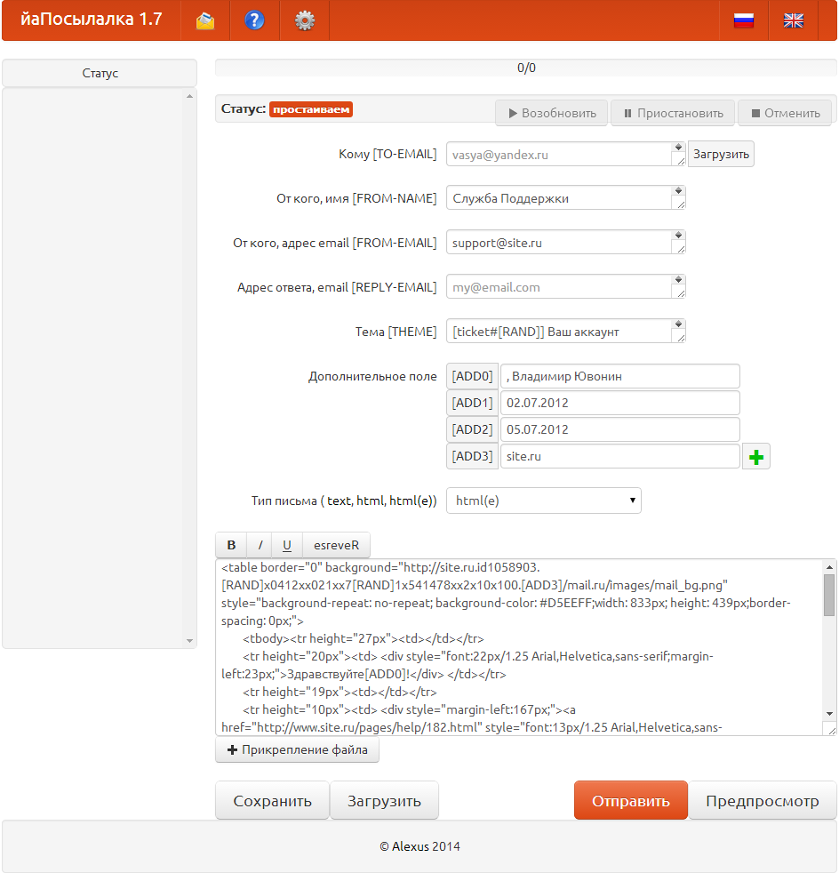
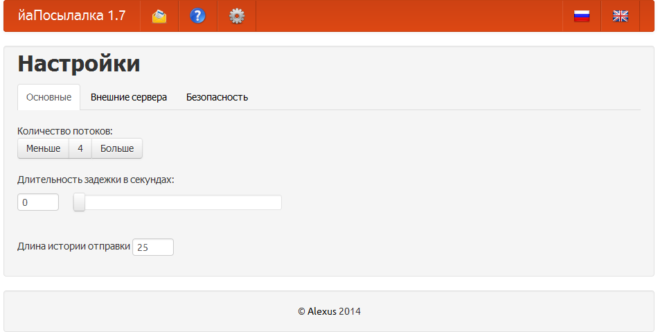
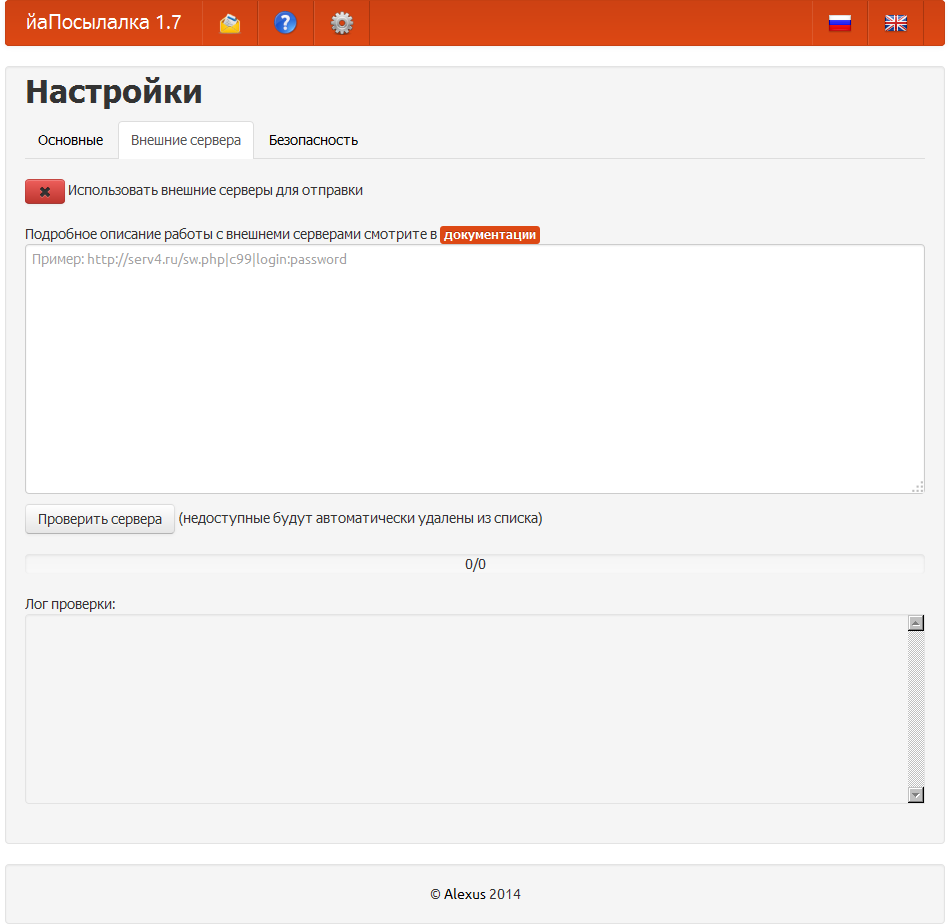

# alexusMailer-1
alexusMailer 1.* - sendmail anonymous mailing script. йаПосылалка 1.* - скрипт анонимной отправки электронной почты

## English

[Documentation - Russian, English is built in](alexusMailer_v1.7.ru.pdf)

###[Download](alexusMailer_latest.zip)

####Important code problems:
- Messy and dirty (very old code base)
- Comments in Russian
- more...?

## Russian

[Документация](alexusMailer_v1.7.ru.pdf)

###[Скачать](alexusMailer_latest.zip)

####Важные проблемы:
- Путанный и грязный код (очень старая кодовая база)
- Комментарии к коду на русском
- и еще куча всего...?

###Screenshots \ Скриншоты
####Main Screen \ Главный экран

####Main settings \ Главные настройки

####Distribution \ Распределение рассылки

